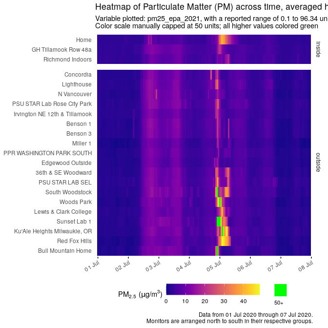
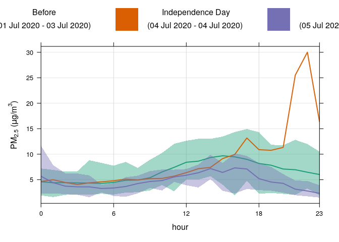

<!-- README.md is generated from README.Rmd. Please edit that file -->

# AirVizR

<!-- badges: start -->
<!-- badges: end -->

The goal of AirVizR is to act as a tool for extracting, wrangling,
correcting, and visualizing spatio-temporal atmospheric data, with an
emphasis on fine particulate matter (PM2.5, i.e. Particulate Matter with
a diameter &lt;2.5 µm) data from
[PurpleAir](https://www.purpleair.com/).  
Correction factor equations from the [Environmental Protection Agency
(EPA)](https://www.epa.gov/) and [Lane Regional Air Protection Agency
(LRAPA)](https://www.lrapa.org/) are implemented to allow for greatest
data accuracy.  
Visualization functions have been carefully selected to maximize
accessibility and data transparency.

## Installation

You can install the development version from
[GitHub](https://github.com/) with:

``` r
# install.packages("devtools")
devtools::install_github("gmcginnis/AirVizR")
```

``` r
library(tidyverse)
#> ── Attaching packages ─────────────────────────────────────── tidyverse 1.3.1 ──
#> ✓ ggplot2 3.3.5     ✓ purrr   0.3.4
#> ✓ tibble  3.1.3     ✓ dplyr   1.0.7
#> ✓ tidyr   1.1.3     ✓ stringr 1.4.0
#> ✓ readr   2.0.0     ✓ forcats 0.5.1
#> ── Conflicts ────────────────────────────────────────── tidyverse_conflicts() ──
#> x dplyr::filter() masks stats::filter()
#> x dplyr::lag()    masks stats::lag()
library(AirVizR)
```

## Wrangling options:

One of three methods of data importation are documented in the
vignettes, via either API or local import;  
\* **API (for PurpleAir)**:  
\* **Local data**  
+ **PurpleAir**: Many of the same arguments as the API setup can be
used. You can download data from PurpleAir’s sensor [download
tool](https://www.purpleair.com/sensorlist). It should be noted that
this data does not include as much information as API data, including
meta information regarding high values or A/B monitor sensor
disparity.  
+ **FRM**: The examples in this package use FRM data from Oregon’s DEQ

## Exaple Visualizations:

### Map Spatio-Temporal Data

``` r
map_stad(july_api_daily, pm25_atm, location_data = july_api_meta, grouping_vars = "date_tag")
#> [1] "Daily set detected: x-axis will map across in units of 24 hours, with axis breaks each day"
#> Joining, by = "site_id"
#> [1] "Data now grouped and averaged. Location data added."
#> [1] "PM 2.5 detected"
#> Map tiles by Stamen Design, under CC BY 3.0. Data by OpenStreetMap, under ODbL.
#> [1] "Base plot created."
#> [1] "Plot now faceted by date_tag"
#> [1] "Final plot created."
```


### Heatmaps

Temporal heat maps use color to represent changes in a variable of
interest over time. Typically, single “cells” (individual observations)
of data are colored to the variable.  
The heatmap options in this package are designed for continuous numeric
variables.

#### Single monitors

To show hourly changes over time for a single monitor, data can be
visualized with the date on the x-axis, and hour of the day on the
y-axis. By default, cell data will also be supplemented with a text
label (which is color-customizable).

``` r
heatmap_single(dataset = july_api_hourly, pm25_epa_2021, "Lighthouse", location_data = july_api_meta)
#> Joining, by = "site_id"
#> [1] "PM 2.5 detected"
#> [1] "Hourly set detected: x-axis will map across in units of hour in each day, with axis breaks each day"
```


#### Multiple monitors

To compare multiple monitors in a set over time (of any temporal
resolution), data can be mapped to a heatmap where the time is on the
x-axis, and the y-axis is monitor labels. Monitors will be separated by
location (i.e. inside/outside), and arranged north to south, allowing
for a general representation of spatial differences.  
This visualization option is ideal for larger data sets with many
monitors.  
Below, an example is shown with the defaults, followed by one with a
“color cap” applied to avoid a washed out color palette. This color
“cap” can be applied to all visualization types with continuous colors
in this package.

``` r
#Before
heatmap_cross(july_api_hourly, pm25_epa_2021, location_data = july_api_meta)
#> [1] "All monitors will be plotted."
#> [1] "PM 2.5 detected"
#> [1] "Hourly set detected: x-axis will map across in units of hour in each day, with axis breaks each day"
#> Joining, by = "site_id"
```



``` r
#After
heatmap_cross(july_api_hourly, pm25_epa_2021, location_data = july_api_meta, cap_value = 50, cap_color = "green")
#> [1] "All monitors will be plotted."
#> [1] "PM 2.5 detected"
#> [1] "Values greater than or equal to 50 in pm25_epa_2021 will be colored green"
#> [1] "Hourly set detected: x-axis will map across in units of hour in each day, with axis breaks each day"
#> Joining, by = "site_id"
```


### Timeseries line graphs

Time series visualizations are useful for representing changes over
time.

#### Spatio-temporal

The following is a visualization option intended to spotlight specific
monitors in a data set. Optional arguments allow for points to be added,
color caps (as above) to be applied, and show/hide maximum & minimum
values for each monitor.

``` r
ts_line(july_api_hourly, pm25_atm, label_filter = "STAR", location_data = july_api_meta, add_points = TRUE)
#> Joining, by = "site_id"
#> [1] "Charts will be arranged in multiple rows and columns."
#> [1] "Hourly set detected: x-axis will map across in units of hour in each day, with axis breaks each day"
#> Joining, by = "site_id"
#> [1] "Average data added."
#> [1] "PM 2.5 detected"
#> [1] "Data points will be added."
```


#### Variation

The following uses the [timeVariation()
function](https://bookdown.org/david_carslaw/openair/sec-timeVariation.html)
from the [OpenAir
package](https://bookdown.org/david_carslaw/openair/).  
It can be modified to compare multiple groups (such as date ranges) or
multiple pollutants.

``` r
ts_variation(july_api_hourly, "pm25_epa_2021", include = "Lighthouse", group = "date_tag", location_data = july_api_meta, subset = "hour")
#> Joining, by = "site_id"
#> [1] "PM 2.5 detected"
#> [1] "Hourly set detected: x-axis will map across in units of hour in each day, with axis breaks each day"
#> Detected data with Daylight Saving Time.
```


    #> [1] "Plot selected: hour"



    #> NULL
