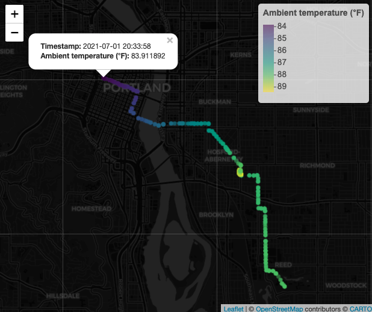
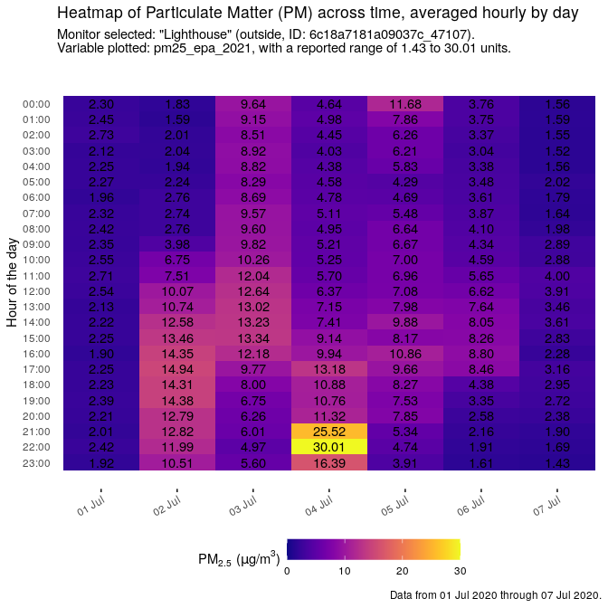
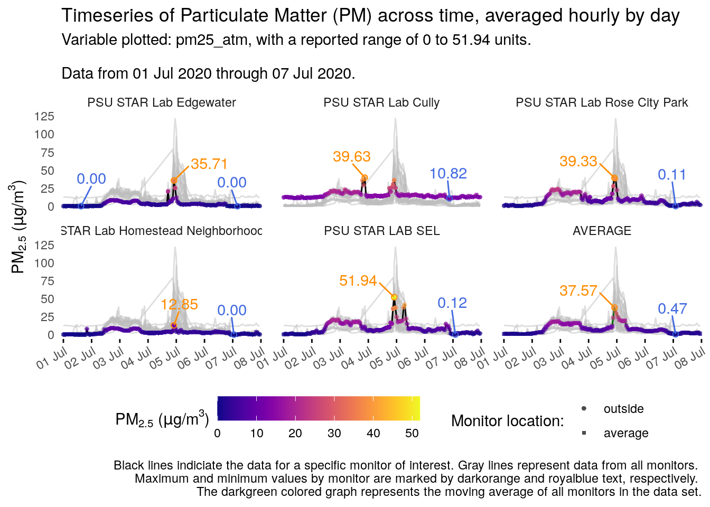

<!-- README.md is generated from README.Rmd. Please edit that file -->

# AirVizR

<!-- badges: start -->
<!-- badges: end -->

The goal of AirVizR is to act as a tool for extracting, wrangling,
correcting, and visualizing spatio-temporal atmospheric data, with an
emphasis on fine particulate matter (PM2.5, i.e. Particulate Matter with
a diameter &lt;2.5 µm) data from
[PurpleAir](https://www.purpleair.com/).  
Correction factor equations from the [Environmental Protection Agency
(EPA)](https://www.epa.gov/) and [Lane Regional Air Protection Agency
(LRAPA)](https://www.lrapa.org/) are implemented to allow for greatest
data accuracy.  
Visualization functions have been carefully selected to maximize
accessibility and data transparency.

## Installation

You can install the development version from
[GitHub](https://github.com/) with:

``` r
# install.packages("devtools")
devtools::install_github("gmcginnis/AirVizR", build_vignettes = TRUE)
```

``` r
# Load the library
library(AirVizR)
```

## Wrangling options:

Many of the functions in this package are intended to work hand-in-hand
with a series of provided inputs, hence why many of the defaults inputs
for man class types are “`input_*`” or “`raw_*`”. For full lists of
inputs, browse the vignettes.

One of three methods of data importation are documented in the
vignettes, via either API or local import;  
\* **API** (PurpleAir only): Using a series of functions, some derived
from the [AirSensor](https://mazamascience.github.io/AirSensor/)
package, archived PurpleAir data can be pulled if provided coordinates
and date ranges of interest. See the `api-data` vignette for more
information. \* **Local data**  
+ **PurpleAir**: Many of the same arguments as the API setup can be
used. You can download data from PurpleAir’s sensor [download
tool](https://www.purpleair.com/sensorlist). It should be noted that
this data does not include as much information as API data, including
meta information regarding high values or A/B monitor sensor disparity.
See the `local-data` vignette for more information.  
+ **FRM**: Although currently no functions are explicitly dedicated to
loading FRM data, the visualization functions can be applied to them.
The examples in this package use FRM data from Oregon’s DEQ. See the
`frm-data` vignette for more information.

The data preparation functions are primarily configured for using
PurpleAir data sets, however other types can be wrangled in similar
methods. All spatio-temporal atmospheric data (STAD) sets can be
visualized using the functions in this package, so long as the following
structures are followed:  
\* A data frame of STAD with at least one column for a time stamp of any
unit, one column for the atmospheric unit of interest, and one
identifying column (`site_id`).  
\* A data frame of meta/location data for each `site_id` in the STAD,
including latitudes, longitudes, and location (inside/outside/FRM).

## Exaple Visualizations:

### Map Spatio-Temporal Data

To represent both the spatial and temporal aspects of atmospheric data,
maps can be used to visualize multiple monitors.  
Visual options, such as point size and background graphics, can also be
customized.


### Map Temporal Data

Functions allow for the use of data from
[ObservAir®](https://www.dstech.io/), which is an air monitor that
records changes over time as well as location. Below is an example of
temperature changes during a commute.  
In RStudio and HTML, this map is interactive!



### Heatmaps

Temporal heat maps use color to represent changes in a variable of
interest over time. Typically, single “cells” (individual observations)
of data are colored to the variable.  
The heatmap options in this package are designed for continuous numeric
variables.

#### Single monitors

To show hourly changes over time for a single monitor, data can be
visualized with the date on the x-axis, and hour of the day on the
y-axis. By default, cell data will also be supplemented with a text
label (which is color-customizable).



#### Multiple monitors

To compare multiple monitors in a set over time (of any temporal
resolution), data can be mapped to a heat map where the time is on the
x-axis, and the y-axis is monitor labels. Monitors will be separated by
location (i.e. inside/outside), and arranged north to south, allowing
for a general representation of spatial differences.  
This visualization option is ideal for larger data sets with many
monitors. Optionally, monitors with incomplete data can be filtered
out.  
Below, an example is shown with the defaults, followed by one with only
complete monitors included and a “color cap” applied to avoid a washed
out color palette. This color “cap” can be applied to all visualization
types with continuous colors in this package.


### Timeseries line graphs

Time series visualizations are useful for representing changes over
time.

#### Spatio-temporal

The following is a visualization option intended to spotlight specific
monitors in a data set. Optional arguments allow for points to be added,
color caps (as above) to be applied, and show/hide maximum & minimum
values for each monitor. Additionally, data can be visualized in a
single “column” of results if desired, allowing for easier temporal
cross-comparisons.



#### Variation

A visualization option that builds upon the `timeVariation()` function
from the [OpenAir package](https://bookdown.org/david_carslaw/openair/)
is also available.  
It can be modified to compare multiple groups (such as date ranges) or
multiple pollutants.

``` r
ts_variation(july_api_hourly, "pm25_epa_2021", include = "Lighthouse", group = "date_tag",
    location_data = july_api_meta, subset = "hour")
```

### Combine STADs

STADs can be combined and pivoted in order to visualize data from both
FRMs and PurpleAir monitors simultaneously. The visualization functions
above can be used, or custom ones can be applied:


